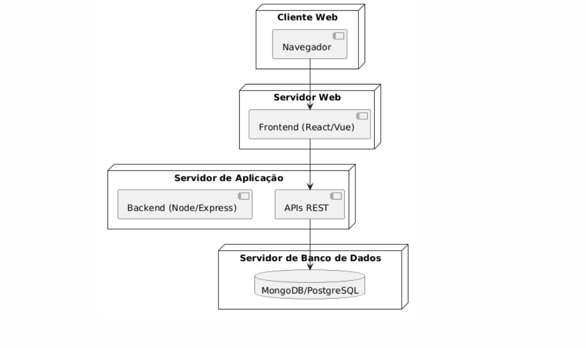
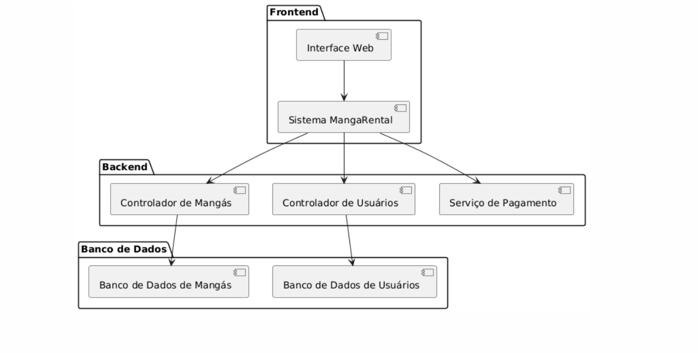
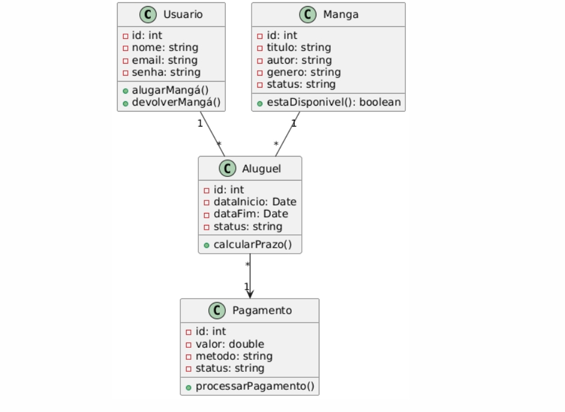
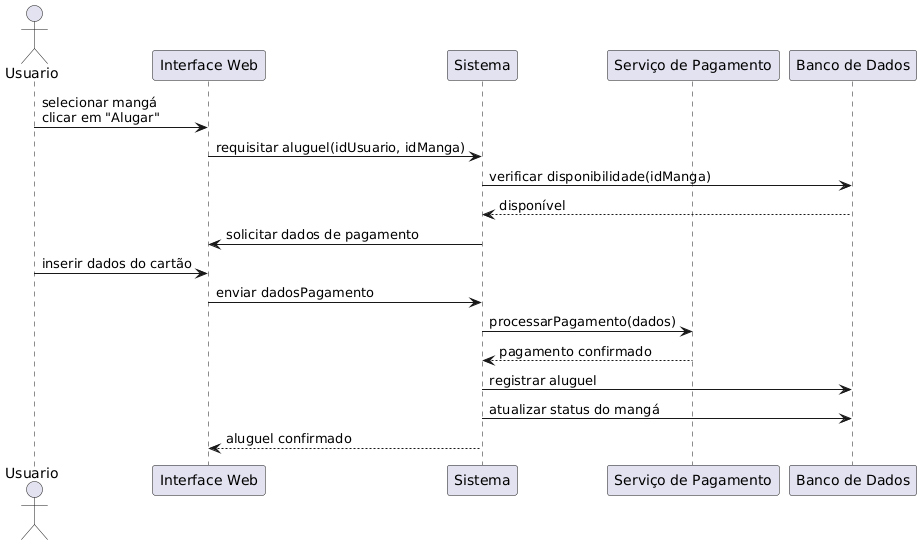
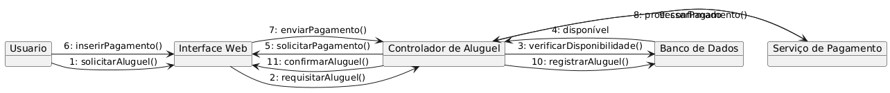
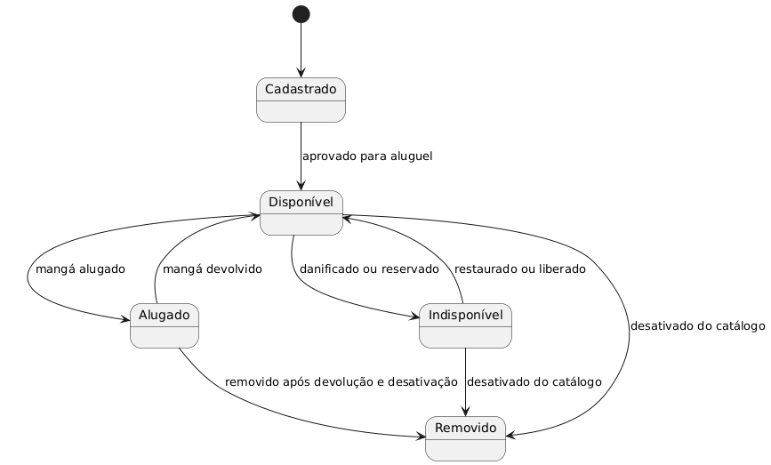
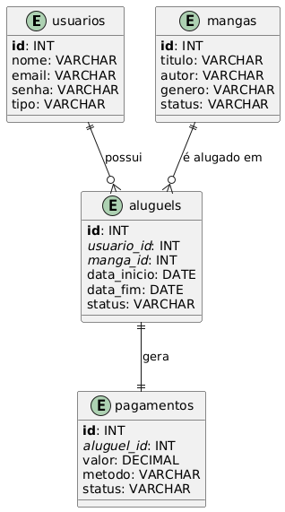

# 📖 MangaRental
 
## Descrição
MangaRental é um sistema de gerenciamento de aluguel de mangás, desenvolvido com o objetivo de facilitar o acesso a obras de mangá de forma prática, organizada e acessível. A plataforma permite que usuários realizem o cadastro, pesquisem títulos disponíveis, efetuem aluguéis, devoluções e pagamentos de forma digital, seja por tempo determinado.
## Tecnologias Utilizadas
- **Linguagem**: React  
- **Framework Backend**: Node.js 
- **Padrão Arquitetural**: MVC  
- **Banco de Dados**: MongoDB  
- **Ferramentas de Versionamento**: Git & GitHub  
- **Documentação**: Markdown & UML

  ## 🎯 Arquitetura  

O sistema segue a **arquitetura MVC (Model-View-Controller)**:  

- **Model (M)**: Representa os dados e regras de negócio.  
- **View (V)**: Interface com o usuário para entrada e visualização de dados.  
- **Controller (C)**: Camada intermediária que recebe requisições, processa e envia dados para a **View** ou interage com o **Model**.  

A comunicação entre os componentes ocorre através de **REST APIs** e a persistência é feita em um banco de dados .

## 📂 Estrutura do Projeto 

📦 sistema-aluguel-mangas  
├ 📂 docs                     

├ 📂 backend                  

│ ├ 📂 src/

│ │ └ 📂 main/

│ │     └ 📂 java/

│ │         └ 📂 com/mangarental/

│ │             ├ 📂 controllers/          

│ │             │   └ MangaController.java

│ │             ├ 📂 services/             

│ │             │   └ AluguelService.java

│ │             ├ 📂 models/               

│ │             │   ├ Usuario.java

│ │             │   ├ Manga.java

│ │             │   └ Aluguel.java

│ │             └ 📂 repositories/        

│ │                 └ MangaRepository.java

│ ├ 📂 resources/

│ │ ├ 📝 application.properties

│ │ └ 📄 data.sql (dados iniciais)

│ ├ 📝 pom.xml                  

│ └ 📝 README.md

│

├ 📂 frontend                
│ │ └ 📝 App.jsx / App.vue

│ ├ 📂 public/

│ ├ 📝 package.json

│ └ 📝 vite.config.js (ou outro config)

│

├ 📂 test                   

│

├ 📝 .gitignore             
├ 📝 README.md               

## 📌 Histórias de Usuário
### **Cliente**
✅ Como cliente, eu quero me cadastrar no sistema, para que eu possa alugar mangás e acessar minha conta.

✅ Como cliente, eu quero fazer login no sistema, para que eu possa acessar meus dados e acompanhar meus aluguéis.

✅ Como cliente, eu quero recuperar minha senha, para que eu possa acessar minha conta caso a esqueça.

✅ Como cliente, eu quero buscar mangás por título, autor ou gênero, para que eu possa encontrar obras do meu interesse.

✅ Como cliente, eu quero alugar um mangá, para que eu possa lê-lo por um período determinado.

✅ Como cliente, eu quero visualizar meu histórico de aluguéis, para que eu possa acompanhar o que já li e por quanto tempo.

✅ Como cliente, eu quero devolver um mangá alugado, para que ele fique disponível novamente no sistema.

✅ Como cliente, eu quero pagar com cartão ou outro método digital, para que o aluguel do mangá seja efetivado com segurança.

### **Administrador**
✅ Como administrador, eu quero fazer login no sistema, para que eu possa acessar a área administrativa.

✅ Como administrador, eu quero adicionar um novo mangá ao catálogo, para que ele esteja disponível para aluguel.

✅ Como administrador, eu quero editar informações de um mangá existente, para manter os dados sempre atualizados.

✅ Como administrador, eu quero remover um mangá do catálogo, para que ele não esteja mais disponível para novos aluguéis.

✅ Como administrador, eu quero visualizar relatórios de uso e aluguéis, para que eu possa tomar decisões estratégicas sobre o acervo.

✅ Como administrador, eu quero gerenciar os dados dos usuários, para manter o sistema seguro e organizado.

## Diagrama de Componentes e Implantação

## Diagrama de Classes

## Diagrama de Sequência

## Diagrama de Comunicação

## Diagrama de Estados

## Modelo de Dados

## Integrantes
  - Matheus Caetano Rocha

 - Rafael Caetano da Silva
